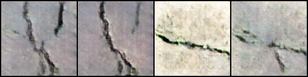

# GAN Training for Image Generation

This repository implements a Generative Adversarial Network (GAN) for generating images. The GAN consists of two primary components:

- **Generator**: Takes a latent vector as input and generates synthetic images.
- **Discriminator**: Attempts to classify images as real (from the dataset) or fake (generated by the generator).

### Example:
- **Generator Output**: from  to 

## Clone the Project

```bash
git clone https://github.com/vantoan2905/GAN_fake_image.git
```

Then navigate to the project folder:
Run command

- For DCGAN version 1:

```bash
cd GAN_fake_image
cd DCGAN
```

- For DCGAN version 2:

```bash
cd GAN_fake_image
cd DCGAN_v2
```

- For Style GAN:

```bash
cd GAN_fake_image
cd StyleGAN

```
and read README file training step.

Or you can navigate to the `develop` folder:

```bash
cd model
```

Then, open the file `./develop.ipynb` for a miniature version of the project.

## Requirements

### 1. Create a Virtual Environment

You can create the environment using conda. First, make sure you have conda or Miniconda installed after cloning the project.

```bash
conda create --name GAN_fake_image python=3.10
conda activate GAN_fake_image
```

### 2. Install Required Packages

After activating the environment, install the required dependencies:

```bash
pip install torch torchvision matplotlib pillow numpy
```

## Project Structure

### DCGAN and DCGAN_v2
The project consists of the following main files:

- **`generator.py`**: Contains the `Generator` and `Generator_256` classes for creating generator models for different image sizes.
- **`discriminator.py`**: Contains the `Discriminator` and `Discriminator_256` classes for creating discriminator models for different image sizes.
- **`customDataset.py`**: Custom dataset class for loading and transforming images.
- **`train.py`**: Main script for training the GAN model, which includes training routines, model saving/loading, and image generation.


### STyleGAN

- **`train.py`**: Main script for training the GAN model, which includes training routines, model saving/loading, and image generation.


## License

This code is released under the MIT License.


